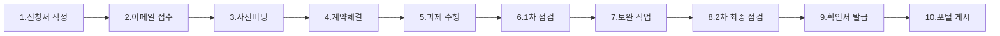

# 전자정부 표준프레임워크 인증 기준 및 모듈 사용 가이드

## 목차
1. [개요](#개요)
2. [호환성 확인 서비스](#호환성-확인-서비스)
3. [호환성 확인 기준](#호환성-확인-기준)
4. [표준프레임워크 적용 요건](#표준프레임워크-적용-요건)
5. [모듈 사용 제한사항](#모듈-사용-제한사항)
6. [Spring Boot와의 차이점](#spring-boot와의-차이점)
7. [인증 절차](#인증-절차)
8. [참고 자료](#참고-자료)

---

## 개요

전자정부 표준프레임워크는 2009년 행정안전부 산하 한국정보화진흥원에서 개발한 웹 기반 애플리케이션 프레임워크입니다. 정부 및 공공기관의 웹사이트에 사용되는 공통 기능들을 Java Spring 프레임워크 기반으로 구현하여 제공합니다.

### 라이선스
- **Apache 2.0 라이선스** 적용
- 외부 오픈소스의 경우 원 오픈소스의 라이선스 정책 유지

### 최신 버전 현황
| 버전 | 출시일 |
|------|--------|
| v4.2 | 2024년 2월 28일 |
| v4.3 | 2025년 3월 6일 |
| v5.0 | 2025년 베타 버전 배포 |

---

## 호환성 확인 서비스

호환성확인 서비스는 민간 분야의 솔루션들이 전자정부 표준프레임워크와 함께 활용될 수 있도록 상용 솔루션 간 연동 가능 여부를 확인하는 **유료 서비스**입니다.

### 확인 대상 영역
| 영역 | 확인 내용 |
|------|----------|
| 아키텍처 | 표준프레임워크 아키텍처 준수 여부 |
| 가이드 | 설치 및 연동을 위한 가이드 제공 여부 |
| 표준프레임워크 호환성 | 실행환경, 개발환경, 공통컴포넌트와의 정상 동작 |

---

## 호환성 확인 기준

### 버전 호환성 기준

```
버전 형식: X.Y.Z
- X: 주버전 (Major)
- Y: 부버전 (Minor)  ← 호환성 확인 기준
- Z: 마이너버전 (Patch)
```

**중요 사항:**
- 호환성 확인은 **부버전(Y) 이상**을 기준으로 개별적/독립적으로 받아야 함
- 예: v3.7 호환성 확인 ≠ v3.5 호환성 확인 (완전히 별개)
- 단, 마이너버전(Z)은 호환됨 (v3.7 확인 시 v3.7.x 모두 호환)

### 호환성 레벨

| 레벨 | 기준 | 설명 |
|------|------|------|
| **레벨2** | 완전 호환 | 모듈을 수정 없이 사용 가능하며 관련 기능들이 모두 정상 동작 |
| **레벨1** | 부분 호환 | 일부 기능이 상용 솔루션의 확장 라이브러리 필요 (커스터마이징 필요 프레임워크, Portal Solution 등) |
| **미호환** | 호환 불가 | 호환 기능이 정상 동작하지 않음 |

> 레벨 간 우선순위는 없으며, 소프트웨어 특성에 따라 결정됩니다.

---

## 표준프레임워크 적용 요건

### 필수 적용 사항

전자정부 표준프레임워크를 사용하려면 다음 요건을 **반드시** 충족해야 합니다:

#### 1. DAO 클래스 상속 필수
```java
// iBatis 사용 시
@Repository
public class SampleDAO extends EgovAbstractDAO {
    // 구현 내용
}

// MyBatis 사용 시
@Repository
public class SampleMapper extends EgovAbstractMapper {
    // 구현 내용
}
```

#### 2. 전자정부 라이브러리 포함 확인
- `/WEB-INF/lib` 폴더에 `egovframework.rte`로 시작하는 `.jar` 파일 존재 필수

#### 3. Import 구문 확인
```java
import egovframework.rte.*  // 이 구문이 소스 코드에 존재해야 함
```

### 적용 확인 체크리스트

| 항목 | 확인 방법 |
|------|----------|
| JAR 파일 | `/WEB-INF/lib`에 `egovframework.rte*.jar` 파일 존재 |
| Import 구문 | `import egovframework.rte` 검색 |
| DAO 상속 | `EgovAbstractDAO` 또는 `EgovAbstractMapper` 상속 확인 |

---

## 모듈 사용 제한사항

### 데이터 액세스 아키텍처 제한

전자정부 표준프레임워크에서 **허용되는 데이터 액세스 방식**:

| 허용 방식 | 비고 |
|----------|------|
| iBatis | Legacy 지원 |
| MyBatis | 권장 |
| JPA | 구현체 상관없음 (Hibernate, EclipseLink 등) |

**사용 불가:**
- ❌ **JdbcTemplate** - 호환성 확인 불가
- ❌ 기타 순수 JDBC 직접 사용

### 실행환경 서비스 구성

전자정부 표준프레임워크는 **8개 서비스 그룹, 39개 서비스**로 구성됩니다:

| 서비스 그룹 | 주요 서비스 |
|------------|------------|
| 화면처리 | MVC, Ajax Support |
| UX처리 | UI Adaptor |
| 업무처리 | Process Control, Exception Handling |
| 데이터처리 | Data Access, ORM, Transaction |
| 연계통합 | Naming Service, Web Service |
| 배치처리 | Batch Core, Batch Execution |
| 모바일 서비스 | Mobile Device API |
| 공통기반 | AOP, Cache, IoC Container, Logging, ID Generation 등 |

### 표준프레임워크 전용 모듈 사용

다음 기능들은 **반드시 전자정부 프레임워크에서 제공하는 모듈**을 사용해야 합니다:

```
✅ 필수 사용 모듈
├── 데이터 액세스 (EgovAbstractDAO, EgovAbstractMapper)
├── ID 생성 (egovframework.rte.fdl.idgnr)
├── 암복호화 (egovframework.rte.fdl.cryptography)
├── 로깅 (egovframework.rte.fdl.logging)
├── 예외처리 (egovframework.rte.fdl.exception)
├── 페이징 (egovframework.rte.ptl.mvc.tags.ui)
└── 공통컴포넌트 (회원관리, 게시판, 권한관리 등)
```

---

## Spring Boot와의 차이점

### 주요 차이점

| 구분 | Spring Boot | 전자정부 표준프레임워크 |
|------|-------------|----------------------|
| 기반 | 순수 Spring Boot | Spring Framework + 전자정부 확장 |
| 설정 | Auto Configuration | XML 기반 설정 (전통적 방식) |
| DAO | 자유로운 구현 | EgovAbstractDAO/Mapper 상속 필수 |
| 공통컴포넌트 | 미지원 | 지원 |
| 호환성 인증 | 대상 아님 | 인증 대상 |

### 중요 제한사항

> **Spring Boot 기반 프로젝트는 전자정부 프레임워크 호환성 확인 대상이 아닙니다.**

- v4.0부터 Spring Boot 기반 프로젝트 지원 시작
- 단, **공통컴포넌트 사용 불가**
- 기반소프트웨어로서의 호환성 확인 불가

### 호환성 확인 분류

| 분류 | 설명 | Spring Boot 해당 여부 |
|------|------|---------------------|
| 기반소프트웨어 | 전자정부 표준프레임워크 기반 | ❌ 해당 안됨 |
| 응용소프트웨어 | 표준프레임워크 위에서 동작 | 조건부 가능 |
| 상용솔루션 | 연동 솔루션 | 조건부 가능 |

---

## 인증 절차

### 호환성 확인 신청 절차 (10단계)



### 상세 절차

| 단계 | 내용 | 담당 |
|------|------|------|
| 1 | 호환성확인 신청서 작성 | 신청 업체 |
| 2 | 이메일 접수 | 점검기관 |
| 3 | 사전미팅 (비용, 일정 협의) | 양측 |
| 4 | 계약 체결 및 비용 입금 | 신청 업체 |
| 5 | 수행과제 수행 (가이드 준수) | 신청 업체 |
| 6 | 1차 점검 (방문 또는 원격) | 점검기관 |
| 7 | 미달사항 보완 | 신청 업체 |
| 8 | 2차 최종 점검 | 점검기관 |
| 9 | 확인서 발급 | 점검기관 |
| 10 | 표준프레임워크 포털 게시 | 점검기관 |

### 소요 기간 및 비용

| 항목 | 내용 |
|------|------|
| 소요 기간 | 평균 3~4주 (업체 수행 기간에 따라 변동) |
| 비용 | 신규/갱신에 따라 상이 (사전협의 시 안내) |
| 문의처 | ☎ 070-4448-2673 |

### 갱신 조건

- 동일 솔루션 버전으로 **표준프레임워크 버전만 변경**하여 재확인 시
- 신규 대비 비용 절감 가능

---

## 참고 자료

### 공식 사이트
- [표준프레임워크 포털](https://www.egovframe.go.kr)
- [표준프레임워크 오픈커뮤니티](https://open.egovframe.org)
- [호환성확인 마이크로사이트](https://open.egovframe.org/oc/compatibility.do)

### 가이드 문서
- [호환성확인 가이드라인 (2024.11.14)](https://maven.egovframe.go.kr/publist/HDD1/public/documents/호환성확인_가이드라인_20241114.pdf)
- [전자정부 표준프레임워크 Wiki](https://www.egovframe.go.kr/wiki)

### GitHub
- [eGovFramework 공식 저장소](https://github.com/eGovFramework)
- [egovframe-docs](https://github.com/eGovFramework/egovframe-docs)

---

## 요약

### 인증을 위한 핵심 체크포인트

1. **DAO는 반드시 전자정부 프레임워크 클래스 상속**
   - `EgovAbstractDAO` (iBatis)
   - `EgovAbstractMapper` (MyBatis)

2. **데이터 액세스는 iBatis/MyBatis/JPA만 사용**
   - JdbcTemplate 사용 불가

3. **전자정부 프레임워크 라이브러리 포함 필수**
   - `egovframework.rte*.jar` 파일

4. **Spring Boot 단독 사용 시 호환성 인증 불가**
   - 공통컴포넌트 사용 불가
   - 기반소프트웨어 분류 해당 안됨

5. **버전별 개별 인증 필요**
   - 부버전(Y) 변경 시 재인증 필요

---

*본 문서는 2024년 12월 기준으로 작성되었으며, 최신 정보는 공식 포털을 참조하시기 바랍니다.*
